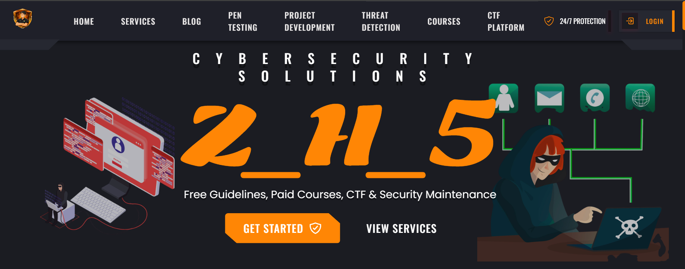

Learn • Hack • Secure

  
  
  
  
  
  

---

##  Graphs & Stats

---

##  Skills & Focus Areas

| Area | Focus | Tools / Topics |
| --- | --- | --- |
|  Defensive Security | Monitoring, Hardening, Incident Response | SIEM, Log Analysis, Detection Rules |
|  Offensive Security | Recon, Exploitation, Reporting | Web Testing, Burp Suite, OWASP Top 10 |
|  AppSec | Secure Coding, Reviews, Threat Modeling | Authentication, Authorization, Security Headers |
|  Automation | Tooling, Scripts, Workflows | Bash, Python, CLI Tools |
|  CTF | Practice & Labs | Linux, Networking, Crypto, Pwn |

##  About ZH5Official

ZH5Official is a cybersecurity-focused platform dedicated to providing:

- Vulnerability Assessment  
- Capture The Flag (CTF) Practice  
- Ethical Hacking Research  
- Free Cybersecurity Guidelines  
- Paid Professional Courses  
- Security Maintenance & Monitoring  

Our mission is to empower students, professionals, and organizations with practical cybersecurity skills.

---

##  Projects & Tools

- Security Automation Tools  
- Web Application Testing Scripts  
- Log Monitoring & Analysis Systems  
- Defensive & Offensive Security Labs  
- CTF Practice Environments  

---

##  Vision

To build a strong cybersecurity community that promotes ethical hacking, security awareness, and real-world defense skills.

---

##  Location

Tiruvannamalai, Tamil Nadu, India

---

##  Connect With Us

-  Instagram: https://www.instagram.com/zh5_official/  
-  GitHub: https://github.com/zh5official  
-  LinkedIn: https://www.linkedin.com/in/zh5official/  
-  WhatsApp Channel: https://whatsapp.com/channel/0029Vb7gPitFCCoM116jcb04  
-  Email: zh5officials.in@gmail.com  

---

##  Disclaimer

All tools and resources available in this repository are strictly for **educational and ethical purposes only**.  
Unauthorized or illegal use is not supported by ZH5Official.

---

Support the project by starring this repository  
Stay Secure | Stay Ethical

